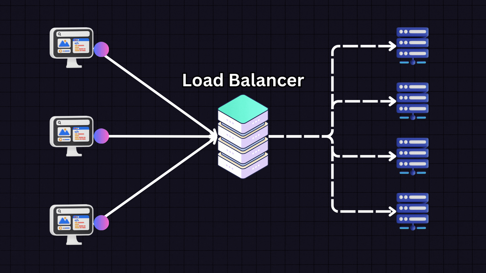
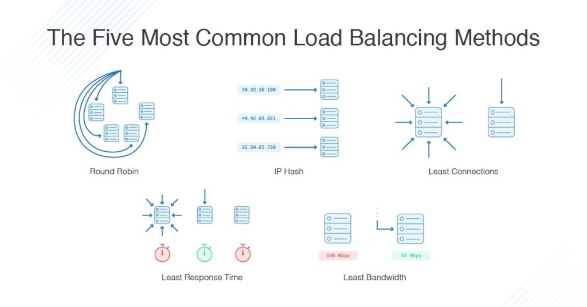

Here’s a simpler breakdown of what a **load balancer** is, the concepts around it, and the difference between an **L4** and **L7** load balancer:

### What is a Load Balancer?
A **load balancer** is like a traffic manager. Imagine cars trying to get onto a highway—if there’s only one lane, traffic jams happen, but if there are multiple lanes, cars can be directed to different lanes to keep things moving smoothly. A load balancer does the same thing with internet traffic by distributing it to different servers so that no single server gets overwhelmed.

### Basic Concepts of a Load Balancer:
1. **Spreads the Traffic**: It sends traffic to multiple servers instead of just one.
2. **Prevents Overload**: If one server gets too much traffic, it might crash; a load balancer avoids this by sharing the load.
3. **Backup Plan**: If one server stops working, the load balancer sends traffic to the working servers, so the website or app stays available.
4. **Health Checks**: It checks if servers are working properly and won’t send traffic to any server that’s down.
5. **Session Stickiness**: Sometimes, it keeps users connected to the same server during their entire session (this is useful when their data is stored temporarily on that server).

### Types of Load Balancers:
There are two main types of load balancers: **L4** (Layer 4) and **L7** (Layer 7). The difference between them is based on how they handle traffic.

#### 1. **L4 Network Load Balancer (Layer 4)**
   - Think of L4 as dealing with **basic traffic management**. It only looks at the **IP address** and **port number** (like knowing which road and lane the car is on) without caring about what’s inside the request (the content).
   - It’s **very fast** because it doesn’t dig deep into the data.
   - Mostly used when speed is the most important thing, and we don’t need to check the content of the data (like in video streaming or messaging).

#### 2. **L7 Application Load Balancer (Layer 7)**
   - L7 digs deeper and looks at the **content** of the traffic. It checks things like the **URL** (the website page being visited) or **headers** (extra information sent with requests), so it can make smarter decisions about where to send the traffic.
   - It can do things like send users to different servers based on the content they are requesting (for example, one server for login pages, another for images).
   - It’s used for websites and web apps where you need to make decisions based on what the user is trying to do.

### Key Differences:
| Feature                  | L4 Network Load Balancer                      | L7 Application Load Balancer                  |
|--------------------------|-----------------------------------------------|-----------------------------------------------|
| **Works on**              | Basic traffic info (IP addresses, port numbers) | The actual content (URLs, headers, etc.)      |
| **Speed**                 | Very fast, minimal checking                   | Slightly slower because it looks deeper       |
| **Use Case**              | Simple, fast traffic distribution (good for speed-sensitive tasks) | Content-based routing (best for websites and apps) |
| **Supports**              | TCP, UDP traffic (e.g., streaming, messaging) | HTTP/HTTPS traffic (websites, web apps)       |

In short:
- **L4** is like a fast traffic cop directing cars (based only on road/lane info), while
- **L7** is a more advanced cop who checks where cars want to go before deciding which lane they should be in.
